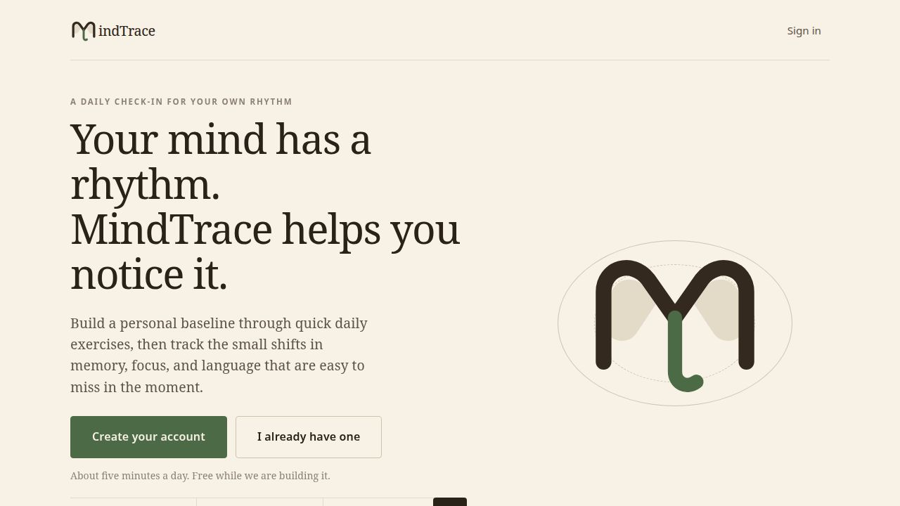

# MindTrace

A daily cognitive check-in for adults over 50 that compares each person against
their own established pattern, rather than against a population average.

Built in a weekend for **Buildathon**, hosted by Replit and The Gen Academy.
Selected as one of **6 finalists out of 75 teams** to present.



> **This is a hackathon prototype, not a medical device.** MindTrace does not
> diagnose anything and cannot detect any medical condition. It is a pattern
> tracker. Anyone worried about their memory or thinking should speak to a
> doctor.

---

## The idea

Cognitive scores vary enormously between healthy people, so a single number
compared against a population norm tells you very little. What is informative is
a person's *drift from their own baseline*.

MindTrace asks for about five minutes a day: a short context check-in (sleep,
mood, stress, energy, caffeine) followed by one to three short exercises. The
first 14 sessions establish a baseline; sessions 8–14 define the "usual range"
that later sessions are read against.

A few decisions we made deliberately:

- **Sleep and stress are context, never a score adjustment.** They are shown
  alongside results so a dip has an explanation, but they never silently
  correct the number.
- **Friends see streaks and attendance, never scores.** Ranking people by
  cognitive performance would make them try harder to climb the board, and that
  effort variance corrupts the very thing the app is trying to measure.
- **Badges reward showing up, not performing.** Same reason.
- **Sessions 1–7 are excluded from the baseline range** to absorb the practice
  effect of learning the games.
- **Large type and large tap targets throughout**, for the intended audience.

## Running it

Python 3.11+. No dependencies, no build step, no package installation — the
server is standard library only and the front end is plain HTML, CSS and
JavaScript with hand-drawn inline SVG charts.

```bash
python3 server.py          # serves on http://localhost:8080
PORT=5000 python3 server.py  # or pick a port
```

The server creates `data/db.json` on first run. That file is gitignored: see
[Security](#security) below.

## Layout

| Path | What it is |
| --- | --- |
| `server.py` | Whitelisted static file server plus a small accounts/sessions API |
| `index.html` | App shell — profiles, check-in, game hub, dashboard, consistency board |
| `app.js` | Front-end wiring and API calls |
| `engine.js` | Pure scoring, baseline, verdict, streak and badge logic — deliberately DOM-free so it can be reasoned about and tested in isolation |
| `styles.css` | Styling |
| `symbol_games.html` | Symbol Match and *What's in a Symbol?* |
| `word_fill.html` | Word Fill |
| `deliverables/` | Pitch deck and business case presented at the Buildathon |
| `docs/screenshots/` | Interface and branding iterations |

### API

All authenticated routes take `Authorization: Bearer <token>`.

```
POST   /api/signup    {email, password, name, birthYear?}  -> {token, user}
POST   /api/signin    {email, password}                    -> {token, user}
GET    /api/me                                             -> {user, sessions}
POST   /api/sessions  {session}                            -> {ok, sessions}
PUT    /api/profile   {name?, birthYear?, theme?}          -> {user}
GET    /api/friends                                        -> {friends, inviteCode}
POST   /api/friends   {code}                               -> {ok, friends}
DELETE /api/friends   {friendId}                           -> {ok, friends}
```

Session data can be exported as CSV from the dashboard.

## Security

Written plainly, because this was built against a hackathon clock:

- Passwords are salted and hashed with PBKDF2-HMAC-SHA256 (120,000 rounds),
  which is the right primitive.
- There is **no** email verification, **no** rate limiting and **no** password
  reset.
- Traffic is plain HTTP unless the host terminates TLS in front of it.
- Accounts live in a single JSON file on disk, guarded by a process-level lock.

This is fine for a prototype and a demo. **Do not put real patient data in it,**
and do not deploy it as-is for real users.

`data/` is gitignored. If you run the app locally, keep it that way — it will
contain real email addresses and password hashes.

## Team

Built at Buildathon (Replit × The Gen Academy), September 19

Awarded top 6 out of 75 teams!

Members - Sahil Mittal, Esha Gupta, Kanishka Agarwal, Jade Jaimes-Chavez

## License

MIT. See [LICENSE](LICENSE).
